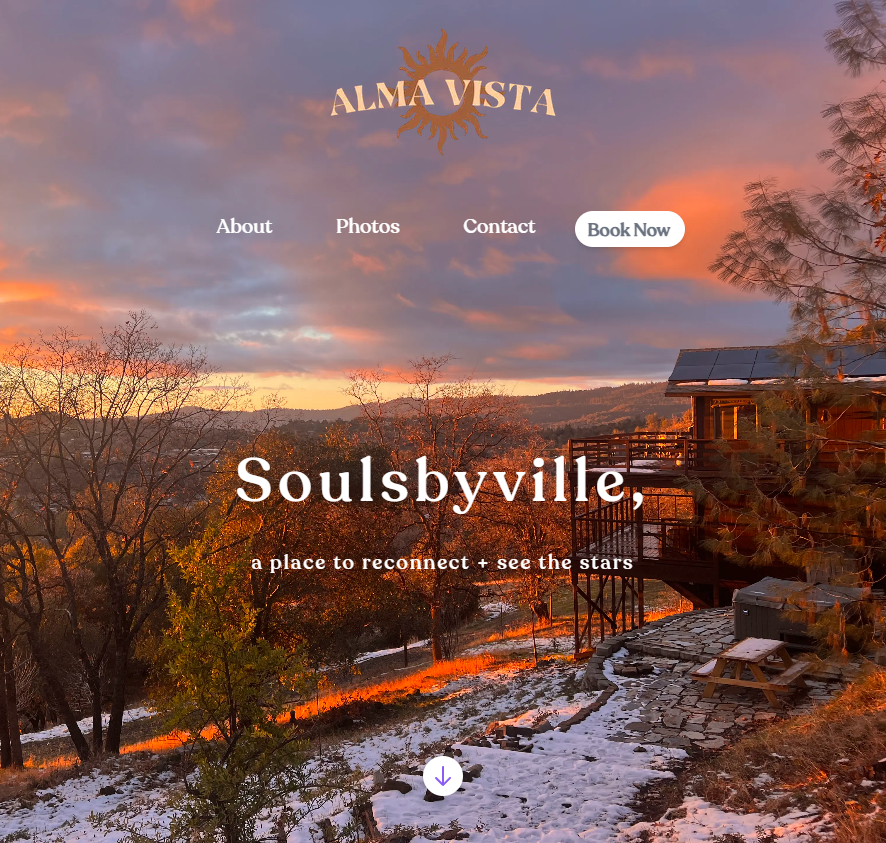

# Alma Vista Rental Home Website

This [website](https://almavistacabin.com) showcases a beautiful short-term rental home and provides users with the capability to directly book their stay using the integrated [IGMS widget](https://www.igms.com/). Built using [Next.js](https://nextjs.org/), [React](https://reactjs.org/), and [Tailwind CSS](https://tailwindcss.com/), the platform offers a seamless user experience and is backed by [MongoDB](https://www.mongodb.com/) for data persistence. The [Google Maps API](https://cloud.google.com/maps-platform/) integration further aids users in identifying the home's location and its surroundings. The website is deployed and hosted on [Vercel](https://vercel.com/).



## Features

- **Direct Booking**: Use the integrated IGMS widget to directly book your stay without any hassles.
- **Interactive Map**: Powered by the Google Maps API, see the exact location of the rental home and explore nearby areas.
- **Responsive Design**: Crafted using Tailwind CSS, the website provides a great user experience across devices.
- **Robust Backend**: With MongoDB as its database, the platform ensures that all data is stored reliably.

## Technologies Used

- [Next.js](https://nextjs.org/)
- [React](https://reactjs.org/)
- [MongoDB](https://www.mongodb.com/)
- [Tailwind CSS](https://tailwindcss.com/)
- [Google Maps API](https://cloud.google.com/maps-platform/)
- [Vercel](https://vercel.com/)

## Installation

### Prerequisites

- Node.js
- MongoDB

### Steps

1. **Clone the repository**:
   ```bash
   git clone https://github.com/bbwax/next-alma-vista-website/
2. **Navigate to the directory:**:
   ```bash
   cd next-alma-vista-website
3. **Install the dependencies:**:
   ```bash
   npm install
4. **Start the development server:**:
   ```bash
   npm run dev
## Usage
After setting up the development server, navigate to http://localhost:3000/ in your browser to view the website.

## Acknowledgments
* Thanks to IGMS for the direct booking widget.
* Shout-out to all libraries and tools that made this possible.
## Contact
Braxton Waxdeck 
Braxton.waxdeck@gmail.com